## 🚌 다행 (다같이 행복행)

- 메타버스를 활용하여 다같이 더불어 사는 행복한 세상을 만들기 위한 특수학급 체험학습 플랫폼 `다행` 입니다.

<br/>

### ❗ 아하텍의 모든 것 
- Product Server 
   - [https://da-haeng.com](https://da-haeng.com)
   - [https://k4b102.p.ssafy.io](https://k4b102.p.ssafy.io)
- Develop Server
   - [https://kichulove.da-haeng.com](https://kichulove.da-haeng.com) (kichul is... love... 💘)
   - [https://k4b1021.p.ssafy.io](https://k4b1021.p.ssafy.io)
- [위키(노션) 바로가기](https://www.notion.so/686c4135a4934eab92ae303e37fa8aec)
<br/> <br/> <br/>


## 🧐 팀 소개

### 💡 아하텍

- 3번의 프로젝트를 거치며 깨달은 `아하! `들을 모두 적용하여 최고의 서비스를 제작하기 위해 모인 개발자들입니다.

|   Name   | 이주희           | 김예슬     | 김창현     | 박수빈 | 백민주     |
| :------: | ---------------- | ---------- | ---------- | ------ | ---------- |
| Profile  |  |  |  |  |  |
| Position | 팀장<br />백엔드 | 프론트엔드 | 프론트엔드 | 백엔드 | 프론트엔드 |

<br/> <br/>

## **📖 목차**

* [아키테쳐](#아키테쳐)
* [기술스택](#기술스택)
* [주요기능](#주요기능)
* [와이어프레임](#와이어프레임)
* [사용방법](#사용방법)
* [Build 방법](#Build 방법)
* [에셋 사용](#에셋 사용)


## **🏰 아키테쳐**

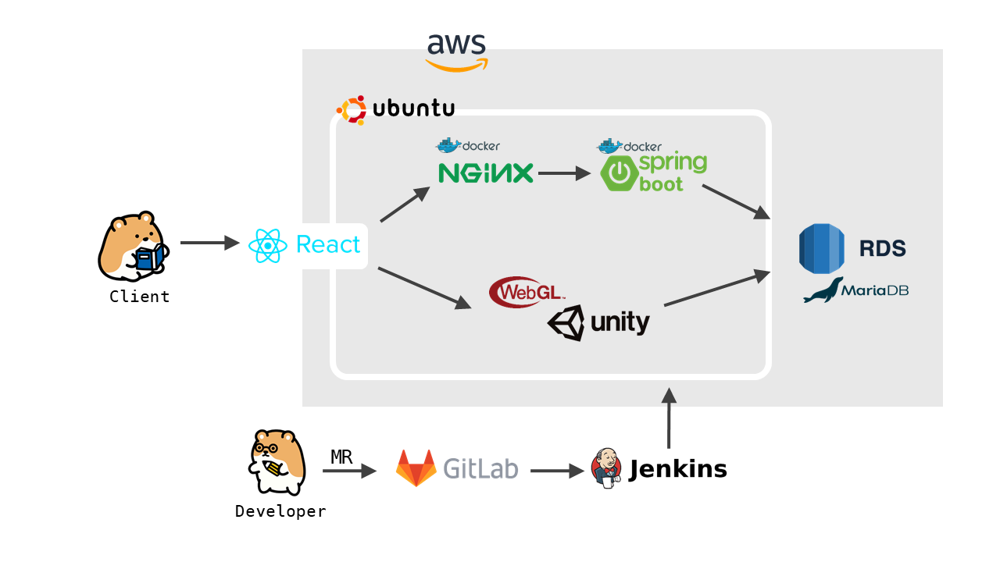

<br/>


## 🔧 기술 스택

### 💻Back-End


### 🎨Front-End


### 🎮 Etc


<br/> <br/>


## 📜 주요 기능

### 가상 체험학습

* 이용방법 설명

  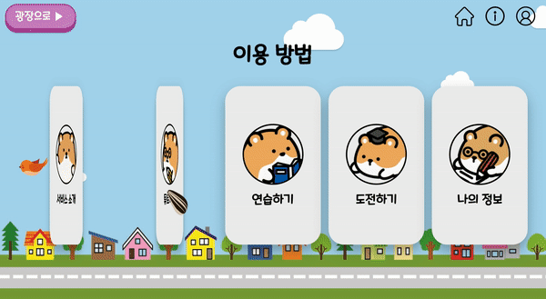

- 캐릭터를 선택해 가상세계로 입장


- 실제와 비슷한 키오스크 체험 환경을 제공

  - 튜토리얼

    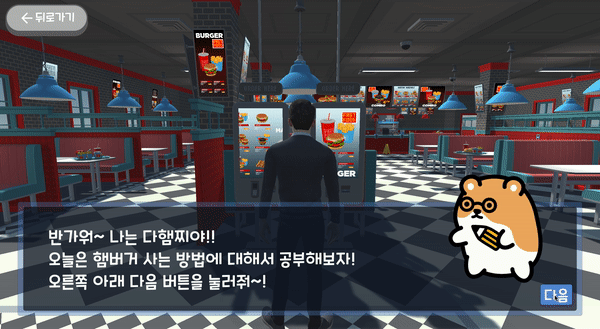

    

  - 연습하기

  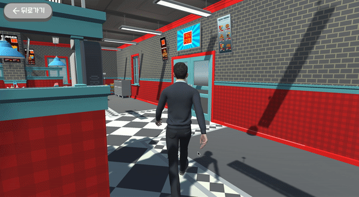

  

  - 도전하기

  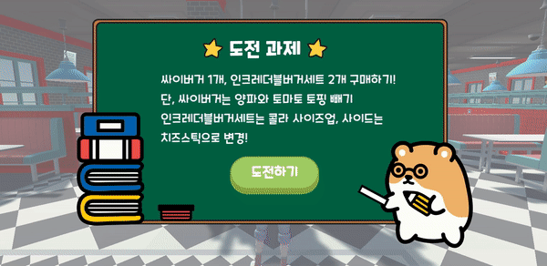

  

- 버스 이용 시뮬레이션을 제공

  - 튜토리얼

  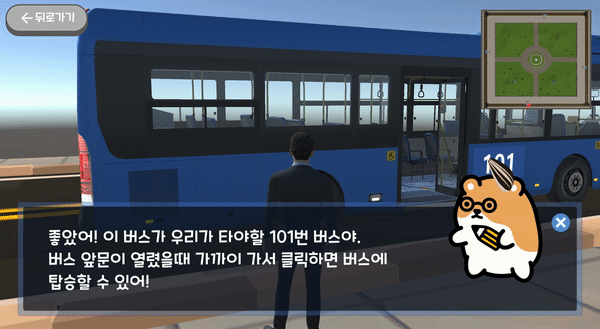

  

  - 연습하기

  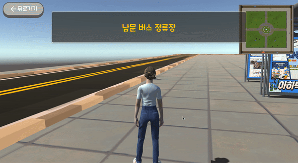

  

  - 도전하기

  

  

- 광장 이용 시뮬레이션을 제공

  

  * 광장 시뮬레이션_멀티플레이

    

    

### 회원 

* 회원가입

  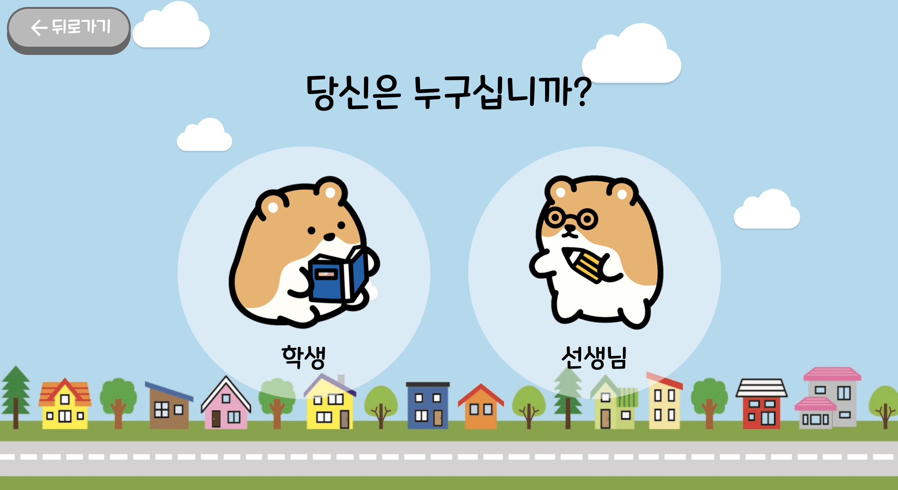

  

  * 학생_담당선생님 코드 입력 (생략 가능)

  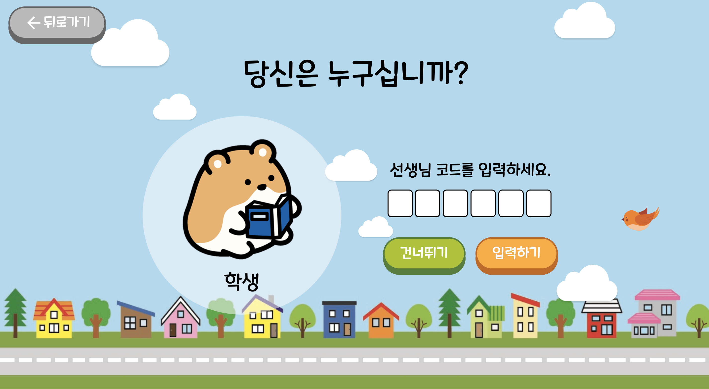

  

  * 선생님 / 학생

  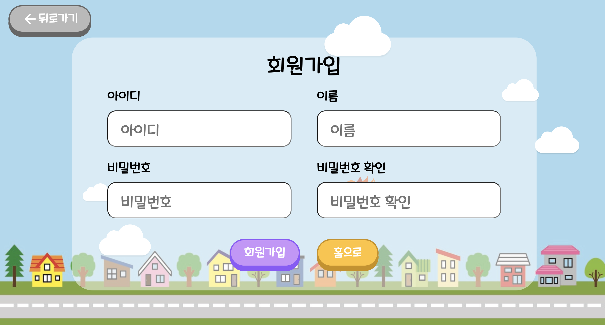

  

* 로그인

  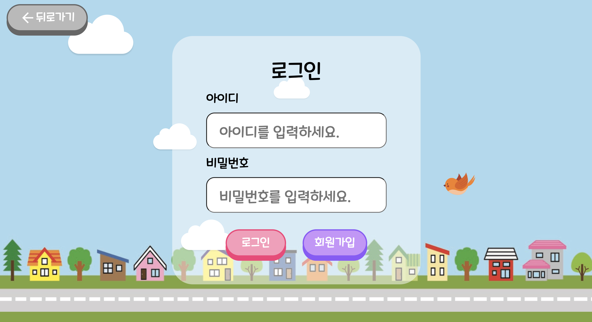

* 마이 페이지에서 자신의 진척도를 조회 가능 

  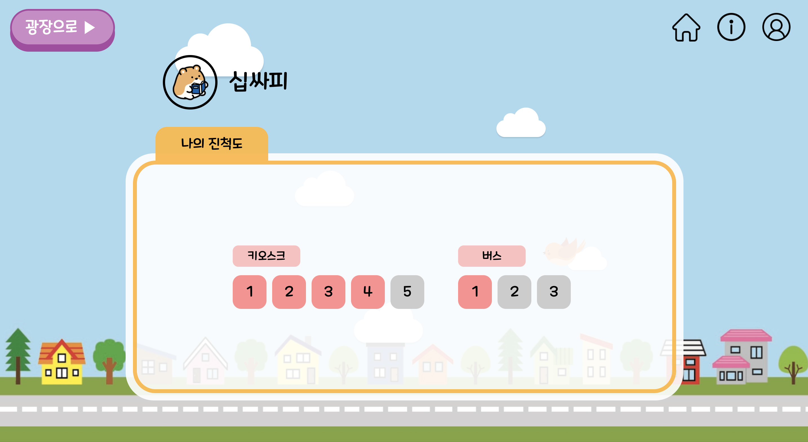

  

### 학생 관리 (선생님용)

- 학생들의 평균 진척도 조회 가능

  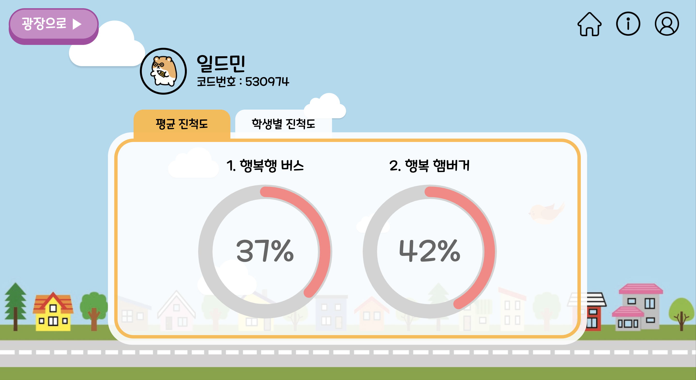

  

- 학생 개인의 과제 수행 진척도를 통해 개인 맞춤형 학습을 제공할 수 있도록 함

  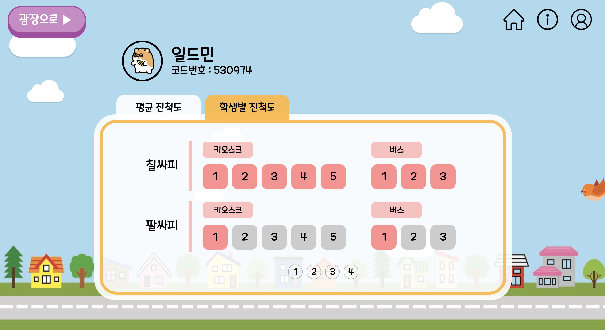

<br/> <br/>
<br/> <br/>


## 🖼 와이어프레임
[Figma 바로가기](https://www.figma.com/file/mL2XwZm10WTW8f47E9eA9o/%EC%95%84%ED%95%98%ED%85%8D?node-id=0%3A1)


<br/> <br/>
<br/> <br/>

## 사용방법

#### Git

```bash
git clone "https://lab.ssafy.com/s04-ai-speech-sub3/s04p23b104.git"
```

<br>

#### Front End

* FE module install

```bash
npm install
```

<br>

#### Back End

* `/backend/src/main/resiurces/application.yaml` 추가
  * `application.yaml` template

```java
spring:
  datasource:
    driver-class-name: org.mariadb.jdbc.Driver
    url: {DB-주소}
    username: {DB-사용자-이름}
    password: {DB-비밀번호}

  jpa:
#    show-sql: true
    hibernate:
      ddl-auto: update
    properties:
      hibernate:
        format_sql: true

server:
  port: 8088
  servlet:
    context-path: /api
```

<br>

* `/backend/src/main/java/com/aha/dahaeng/common/security/jwt/JwtProperties.java` 추가
  * JwtProperties template

```java
package com.aha.dahaeng.common.security.jwt;

public class JwtProperties {
    public static final String SECRET = "{JWT_SECRET}";
    public static final int EXPIRATION_TIME = {JWT_기간};
    public static final int REFRESH_EXPIRATION_TIME = {JWT_refresh_token_기간}; // 14일
    public static final String TOKEN_PREFIX = "{JWT_Prefix}";
    public static final String HEADER_STRING = "{JWT_Header}";
    public static final String REFRESH_HEADER_STRING = "{JWT_refresh_token_Header}";
}

```

- 위의 두 파일은 MatterMost -> 4기 자율 대전1반 - B102_아하텍 (비공개) 채널에 올려두었습니다.
<br>

#### 유니티 빌드 파일 다운로드
- [공유 폴더](https://drive.google.com/drive/folders/1KrOgqr52mz8aaN7NaVobPifzV475_ISc?usp=sharing)에서 다운받으셔야 합니다
- 다운받은 파일을 `/front/public/unitybuild/` 밑에 넣어줍니다. 

<br>

#### 실행

* Front End 실행 스크립트

```bash
npm run start
```

* Back End 실행 스크립트

```bash
cd ./backend
gradlew clean build
j         ava -jar {생성된jar파일이름}
```


## Unity Build 방법

* File/BuildSetting 열기

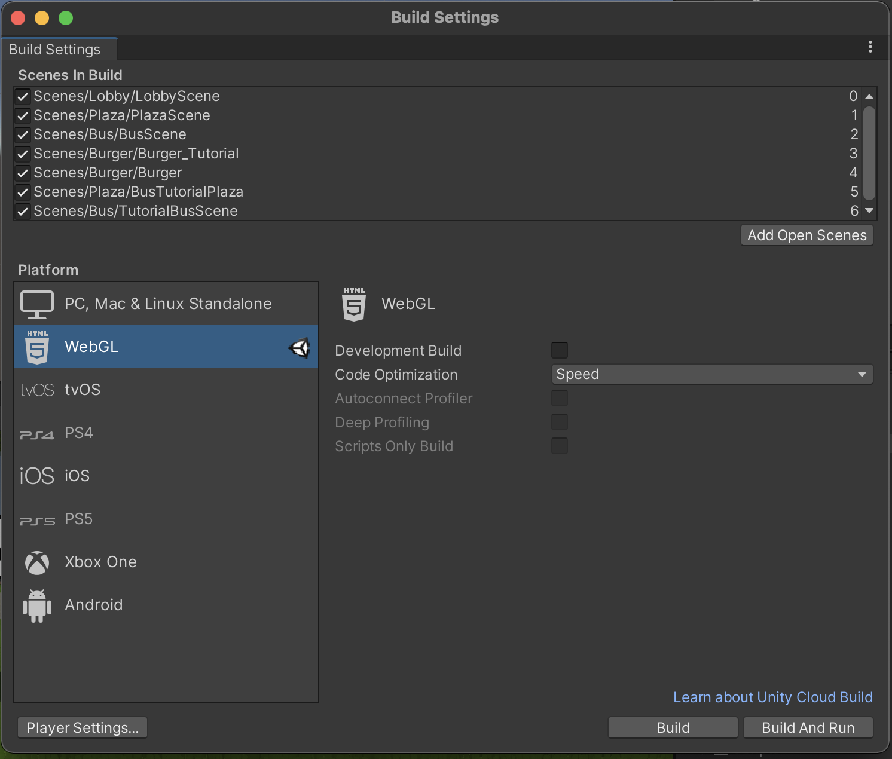

* Player Settings를 눌러 Compression Format을 Disabled로 설정한다.

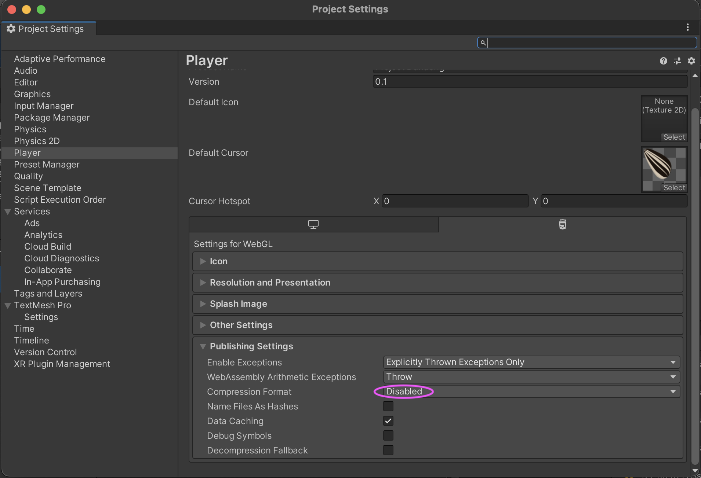

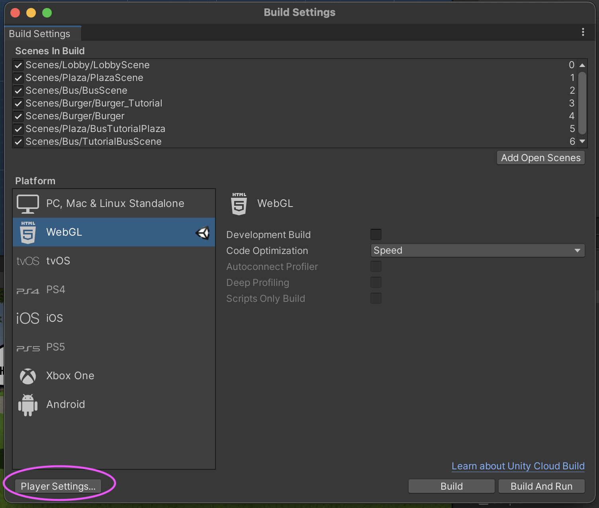

* Player Settings 설정 후 Build를 누르면 Build 된다.

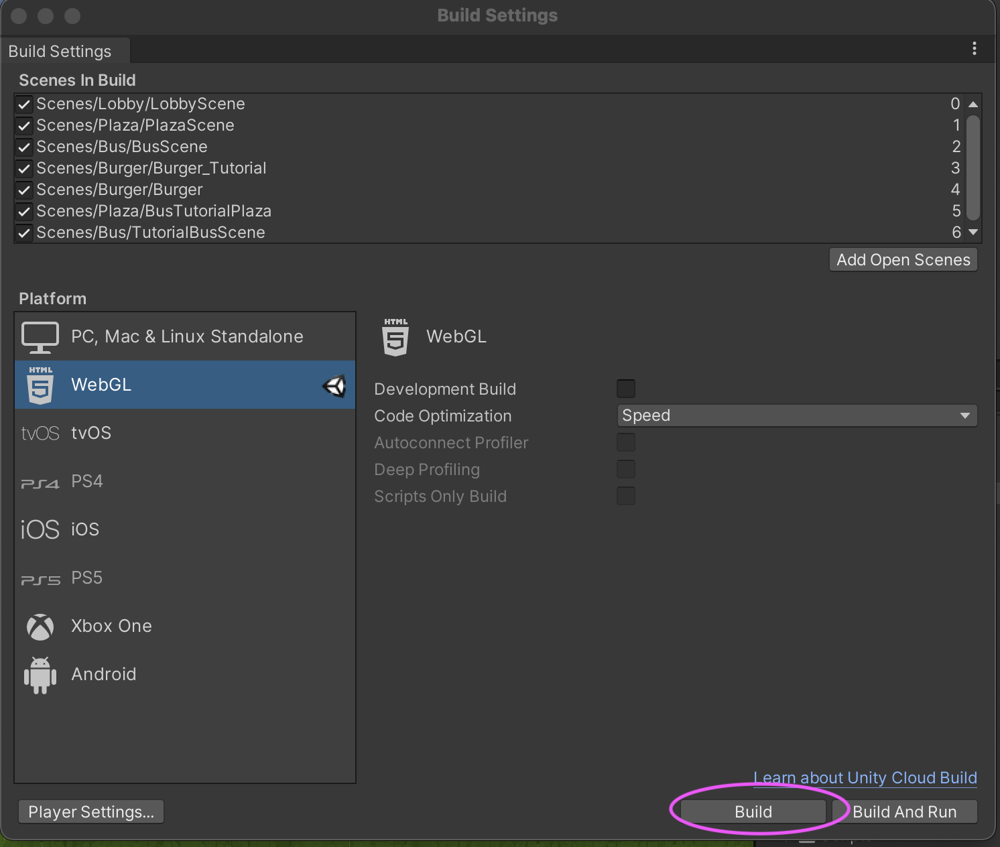

* 파일명을 쓰고 저장

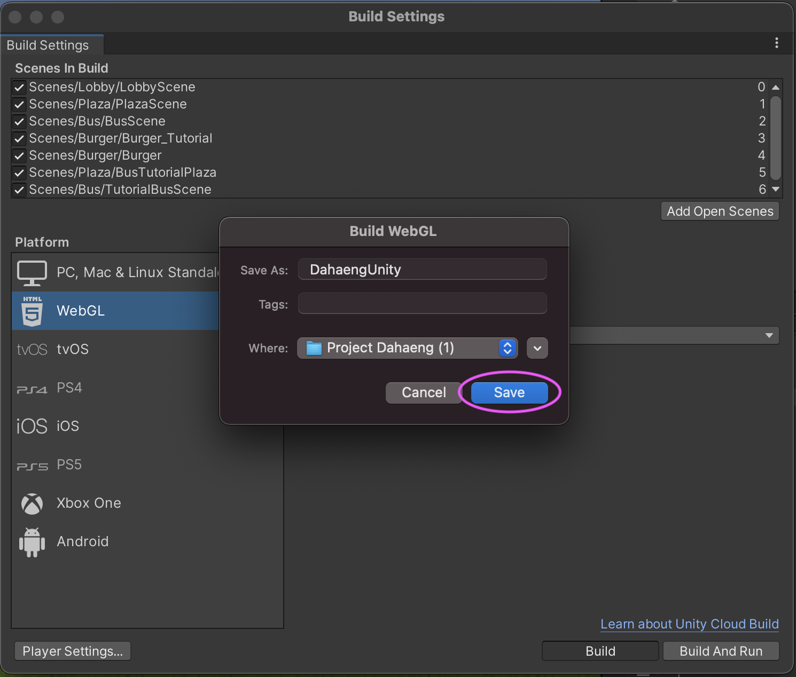

* 빌드

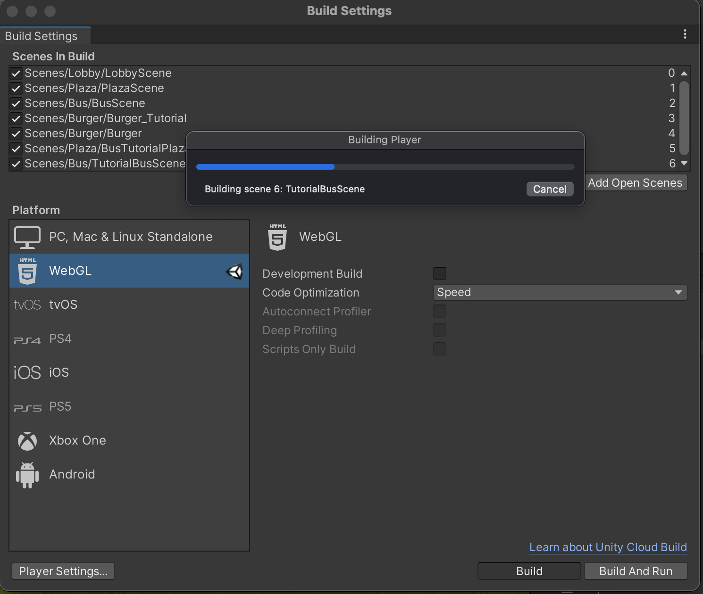

<br>

## 에셋 사용

| 에셋 이름                                 | 활용 내용              | 링크                                                         |
| ----------------------------------------- | ---------------------- | ------------------------------------------------------------ |
| City park                                 | 광장                   | https://assetstore.unity.com/packages/3d/environments/city-park-152068 |
| Cartoon Cafeterias And Restaurants Volume | 버스도로               | https://assetstore.unity.com/packages/3d/environments/urban/cartoon-cafeterias-and-restaurants-volume-1-168804 |
| Low Floor Bus                             | 버스 외부, 내부        | https://assetstore.unity.com/packages/3d/vehicles/low-floor-bus-192605 |
| Bus Stop Modern4                          | 버스 정류장            | https://assetstore.unity.com/packages/3d/environments/urban/bus-stop-modern4-108906 |
| Fastfood interior                         | 패스트 푸드점 인테리어 | https://assetstore.unity.com/packages/3d/environments/urban/fastfood-interior-155298 |

