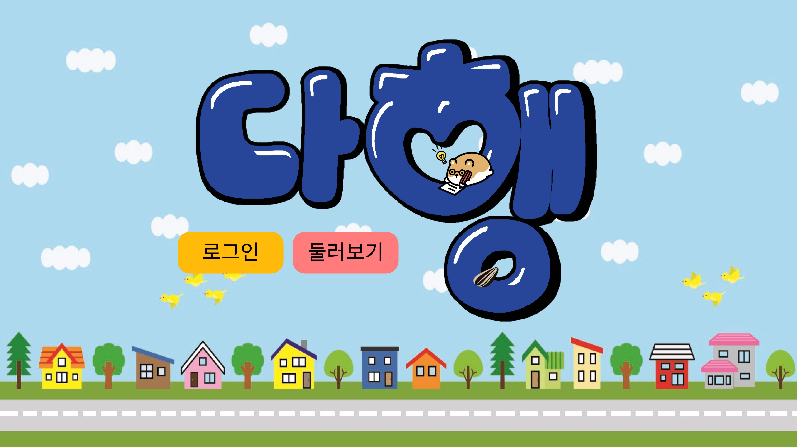
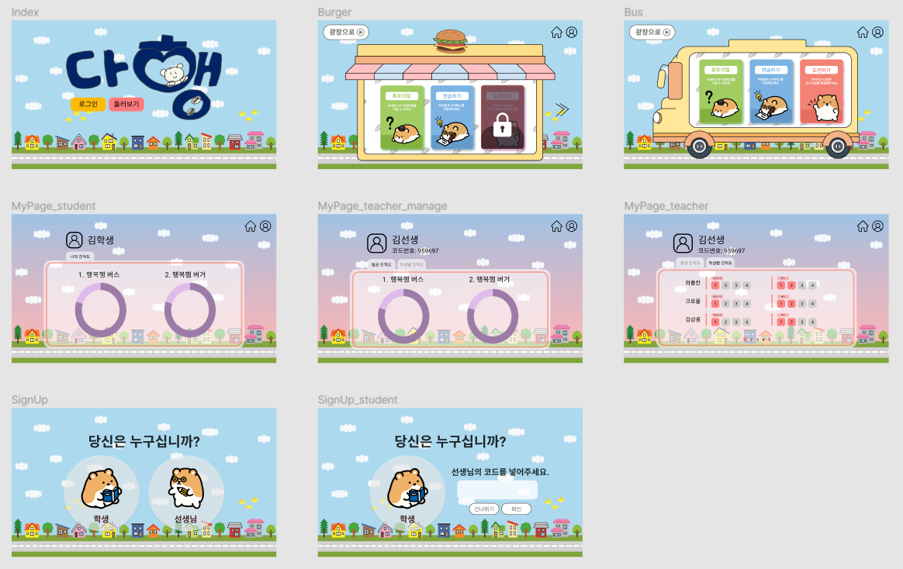

## 🚌 다행 (다같이 행복행)

- 메타버스를 활용하여 다같이 더불어 사는 행복한 세상을 만들기 위한 특수학급 체험학습 플랫폼 `다행` 입니다.

 

### ❗ 아하텍의 모든 것 
- Product Server 
   - [https://da-haeng.com](https://da-haeng.com)
   - [https://k4b102.p.ssafy.io](https://k4b102.p.ssafy.io)
- Develop Server
   - [https://kichulove.da-haeng.com](https://kichulove.da-haeng.com) (kichul is... love... 💘)
   - [https://k4b1021.p.ssafy.io](https://k4b1021.p.ssafy.io)
- [위키(노션) 바로가기](https://www.notion.so/686c4135a4934eab92ae303e37fa8aec)
     

## 🧐 팀 소개

### 💡 아하텍

- 3번의 프로젝트를 거치며 깨달은 `아하! `들을 모두 적용하여 최고의 서비스를 제작하기 위해 모인 개발자들입니다.

|   Name   | 이주희           | 김예슬     | 김창현     | 박수빈 | 백민주     |
| :------: | ---------------- | ---------- | ---------- | ------ | ---------- |
| Profile  |  |  |  |  |  |
| Position | 팀장 백엔드 | 프론트엔드 | 프론트엔드 | 백엔드 | 프론트엔드 |

   

## 🔧 기술 스택

### 💻Back-End

### 🎨Front-End

### 🎮 Etc

   

## 📜 주요 기능

### 가상 체험학습

- 실제와 비슷한 키오스크 체험 환경을 제공
- 버스 이용 시뮬레이션을 제공

### 회원 

- 카카오 로그인

### 학생 관리 (선생님용)

- 학생들의 평균 진척도 조회가능

- 학생 개인의 과제 수행 진척도를 통해 개인 맞춤형 학습을 제공할 수 있도록 함

  

   
   

## 🖼 와이어프레임
[Figma 바로가기](https://www.figma.com/file/mL2XwZm10WTW8f47E9eA9o/%EC%95%84%ED%95%98%ED%85%8D?node-id=0%3A1)

